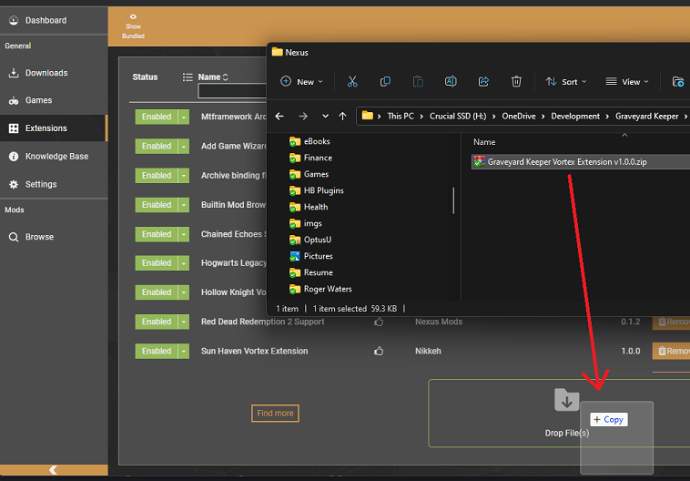
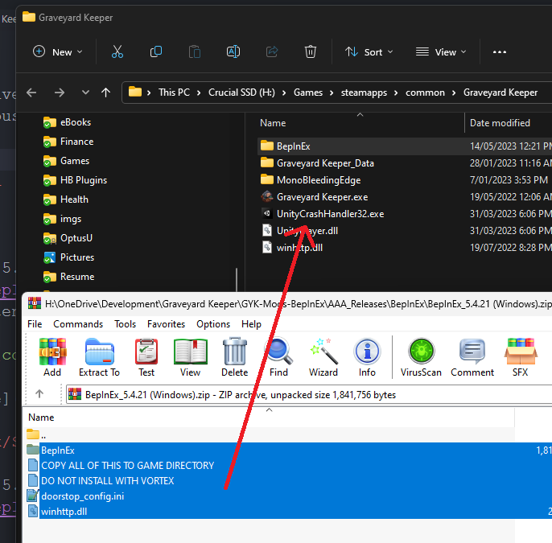

## Graveyard Keeper QMod -> BepInEx Conversion

 

 

## Notes

- Larger Scale and Ultra-Wide have been combined as they were effectivly the same mod patch wise. It's now called ShowMeMoar and **isn't limited** to ultra-wide users. The zoom functions have been greatly enhanced as well (among other things.)
- Some mod features may have changed/behave differently than before. If anything is broken, let me know as usual.
- You need to install the helper separately. It is no longer bundled. Get it [here.](https://github.com/p1xel8ted/GYK-Mods-BepInEx/releases/download/bepinex/GYKHelper_v3.0_BepInEx.zip)

## Features

- Every mod converted to BepInEx. This removes the need for injector patching and QMod Manager Reloaded. Also allows greater cross-platform support.
- Much more robust keyboard binding with modifier keys supported.
- ConfigurationManager bundled allowing you to press F1 in game to bring up configuration options for each mod. Almost all mods have been updated to not need restarting, so most changes should take effect immediately. **Definite exceptions are Where's Ma' Storage & Queue Everything**, for other mods, if you make a change and it doesn't appear to do anything, restart the game.

## Nexus/Vortex Extension

- A Vortex extension has been developed to assist in the migration to that as a mod manager should you choose to. The extension is not compatible with QMods. Do not install BepInEx via Vortex, it will not be installed correctly. Follow the instructions below. This will be submitted to Nexus at some point.

### Extension Installation

Download the extension [here.](https://github.com/p1xel8ted/GYK-Mods-BepInEx/releases/download/bepinex/Graveyard.Keeper.Vortex.Extension.v1.0.0.zip)

 

## BepInEx Installation

### Windows

- Grab BepInEx 5.4.21 Windows from [here.](https://github.com/p1xel8ted/GYK-Mods-BepInEx/releases/download/bepinex/BepInEx_5.4.21.Windows.zip)
- Copy the contents of the zip into main game directory like so:

`...\steamapps\common\Graveyard Keeper`

 

### MacOS/Linux/SteamDeck*

*The Windows version does work with configuration - but that is out of the scope of this short guide.

- Grab BepInEx 5.4.21 Unix from [here.](https://github.com/p1xel8ted/GYK-Mods-BepInEx/releases/download/bepinex/BepInEx_5.4.21.NativeUnix.zip)

Installing BepInEx on Linux/MacOS

1. https://docs.bepinex.dev/v5.4.21/articles/user_guide/installation/index.html?tabs=tabid-nix

Running native Unix games through Steam

2. https://docs.bepinex.dev/v5.4.21/articles/advanced/steam_interop.html

### Community

https://discord.gg/8aVNQAXsug

